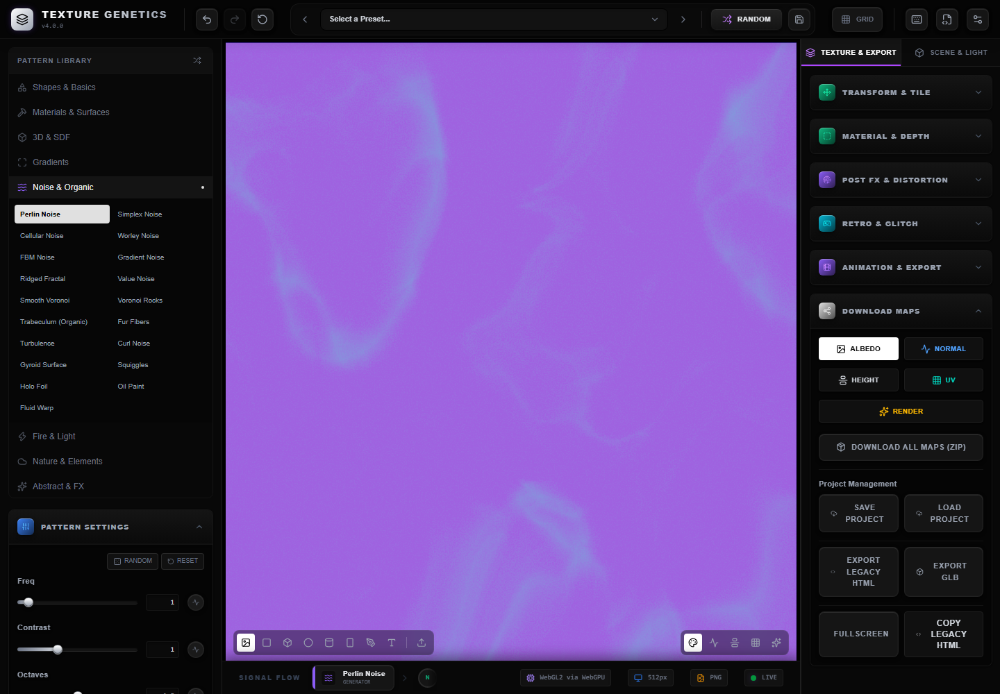
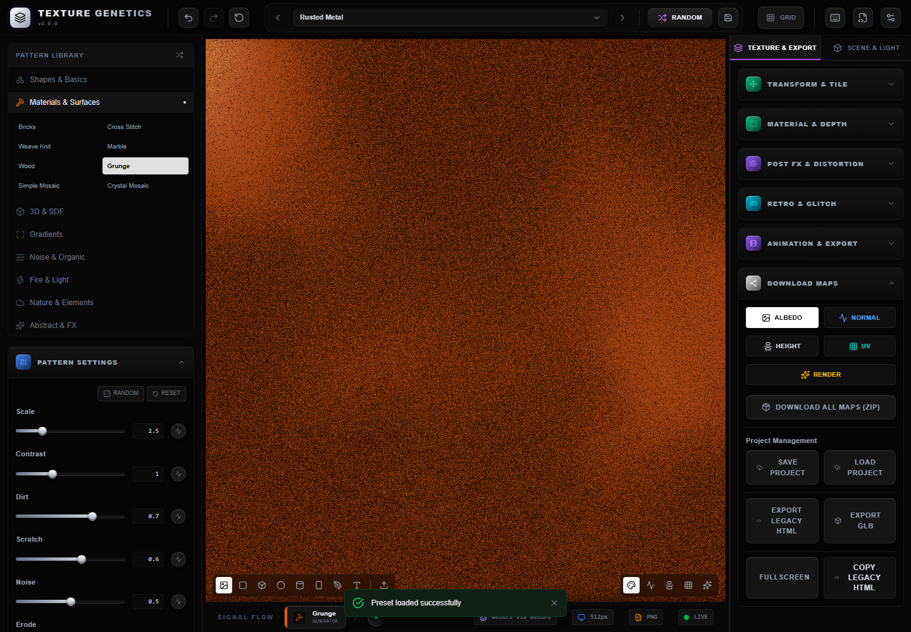
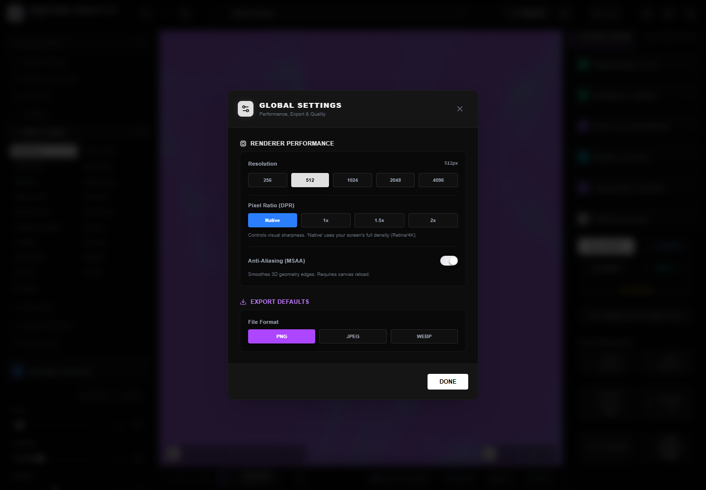
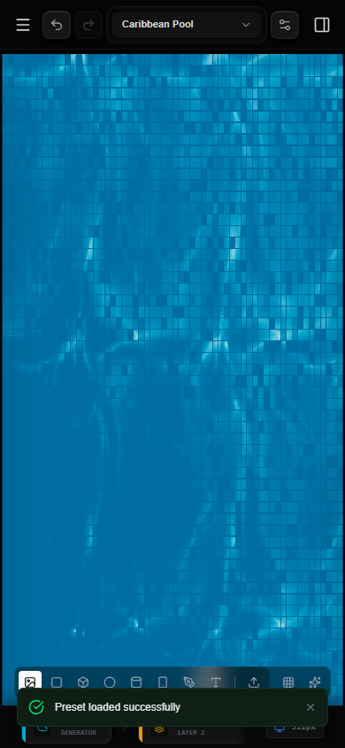

<p align="center">
  <picture>
    <source media="(prefers-color-scheme: dark)" srcset="https://shieldcn.dev/header/document.svg?title=Texture+Genetics&subtitle=Breed+materials.+Inspect+signals.+Export+maps.&logo=grid3x3&theme=purple&align=center&mode=dark" />
    
  </picture>
</p>

<p align="center">
  <a href="https://github.com/gvastethecreator/texture-genetics/actions/workflows/validate.yml"></a>
  <a href="https://gvastethecreator.github.io/texture-genetics/"></a>
  <a href="https://pnpm.io/"></a>
  <a href="#what-it-does"></a>
  <a href="LICENSE"></a>
</p>

Browser workstation for procedural textures, animated materials, and PBR-ready exports.

[Live workstation](https://gvastethecreator.github.io/texture-genetics/) · [Get started](#start) · [Documentation](#documentation) · [Contributing](CONTRIBUTING.md) · [Sponsor](https://github.com/sponsors/gvastethecreator)

Texture Genetics runs a hybrid TSL/GLSL pipeline in React and Three.js. It targets
technical artists, game developers, and UI designers who need to build and export
textures without a desktop DCC tool.

## Product tour

These captures come from the production build running its real WebGL texture pipeline. They show active controls, presets, and responsive behavior rather than presentation mockups.

| Texture workbench | Rusted Metal preset |
| --- | --- |
|  |  |
| **Global settings** | **Mobile workbench** |
|  |  |

## What it does

- Real-time WebGPU/WebGL preview with procedural TSL and GLSL patterns
- PBR material controls, normal maps, displacement, masks, and layered stickers
- Built-in geometry, text, SVG, OBJ, glTF, and GLB preview
- Presets, undo/redo, IndexedDB persistence, and responsive editor panels
- PNG, JPG, WebP, GIF, WebM, sprite sheet, GLB, HTML, and ZIP exports
- Lazy-loaded exporters with build-size and coverage gates

## Start

Requirements: Node.js 22 or newer, pnpm 12.0.0 or newer, and Git.

```bash
git clone https://github.com/gvastethecreator/texture-genetics.git
cd texture-genetics
pnpm install --frozen-lockfile
pnpm run dev
```

Open `http://localhost:3000`.

## Main commands

```bash
pnpm run dev           # Development server
pnpm run check         # Lint, format check, and typecheck
pnpm run test          # Test suite
pnpm run test:coverage # Tests plus coverage thresholds
pnpm run build         # Production build plus bundle budgets
pnpm run clean         # Remove generated output and logs
```

VS Code exposes the same commands through short emoji tasks in
[`.vscode/tasks.json`](.vscode/tasks.json).

## Documentation

- [Setup and deployment](docs/SETUP.md)
- [Changelog](docs/CHANGELOG.md)
- [Contributing](CONTRIBUTING.md)
- [Security policy](.github/SECURITY.md)

## Project status

- React 19, Three.js 0.185, Vite 8, Tailwind CSS 4, TypeScript 7, Node.js 22+, and pnpm 12.0.0
- Direct dependencies match their latest published versions as of 2026-08-15
- CI validates formatting, lint, types, coverage thresholds, and production build
- Browser target: current Chromium, Firefox, and Safari with WebGL 2 or WebGPU

## Support

If Texture Genetics helps your art or game pipeline, you can [sponsor continued development](https://github.com/sponsors/gvastethecreator) or [buy the maintainer a coffee](https://ko-fi.com/gvaste). Focused bug reports and improvements are welcome through [GitHub Issues](https://github.com/gvastethecreator/texture-genetics/issues) and [CONTRIBUTING.md](CONTRIBUTING.md).

## License

MIT. See [LICENSE](LICENSE).
